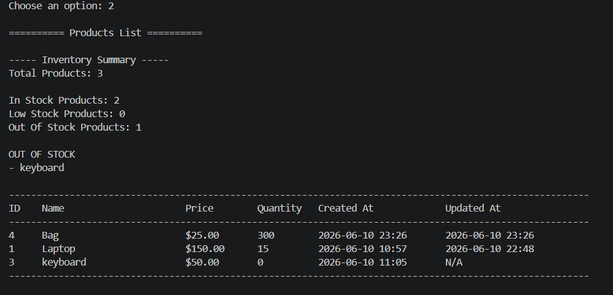
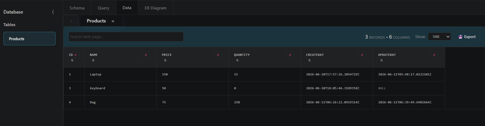

# Inventory Management System

## Overview

Inventory Management System is a console-based application built with C# and .NET.

The application allows users to manage products stored in an inventory through a simple and user-friendly console interface. Users can add, view, search, update, and delete products while all data is persisted using SQLite.

The project follows a layered architecture that separates presentation, business logic, and data access responsibilities.

---

## Features

### Product Management

- Add new products
- View all products
- Search for products by name
- Update existing products
- Delete products with confirmation

### Validation

- Prevent empty product names
- Prevent duplicate product names
- Ensure product prices are greater than zero
- Ensure product quantities are non-negative


### Data Persistence

- Product data is stored in a SQLite database
- Data remains available after closing the application
- Automatic database initialization

---

## Technologies Used

- C#
- .NET
- SQLite
- Microsoft.Data.Sqlite
- Git
- GitHub

---

## Architecture

```text
Presentation Layer
    │
    ▼
Controllers
    │
    ▼
Services
    │
    ▼
Repositories
    │
    ▼
SQLite Database
```

The application follows a layered architecture where each layer has a single responsibility:

- **Controllers** handle application flow and user actions.
- **Services** contain business logic and validation rules.
- **Repositories** manage data access and database operations.
- **Database** handles SQLite persistence.

---

## Project Structure

```text
InventoryManagementSystem
│
├── Controllers
│   └── InventoryController.cs
│
├── Views
│   ├── MenuView.cs
│   └── ProductView.cs
│
├── Services
│   ├── IInventoryService.cs
│   └── InventoryService.cs
│
├── Repositories
│   ├── IProductRepository.cs
│   └── SqliteProductRepository.cs
│
├── Database
│   └── DatabaseInitializer.cs
│
├── DTOs
│   ├── CreateProductDto.cs
│   └── UpdateProductDto.cs
│
├── Models
│   └── Product.cs
│
├── Helpers
│   └── InputHelper.cs
│
└── Program.cs
```

---

## Product Model

Each product contains:

- Id
- Name
- Price
- Quantity
- CreatedAt
- UpdatedAt

---


## Screenshots

### Main Menu


### View Products



### Edit & Search Product


### Database



---

## Database

The application uses SQLite for data storage.

Products are stored in a table named:

```sql
Products
```

## Inventory Status Tracking

The system automatically categorizes products based on quantity:

| Status | Condition |
|----------|------------|
| In Stock | Quantity > 5 |
| Low Stock | Quantity between 1 and 5 |
| Out Of Stock | Quantity = 0 |

This helps identify products that need restocking.

---

## How to Run

### Clone the repository

```bash
git clone <https://github.com/AfafNasr/InventoryManagementSystem>
```

### Navigate to the project folder

```bash
cd InventoryManagementSystem
```

### Restore packages

```bash
dotnet restore
```

### Run the application

```bash
dotnet run
```

---